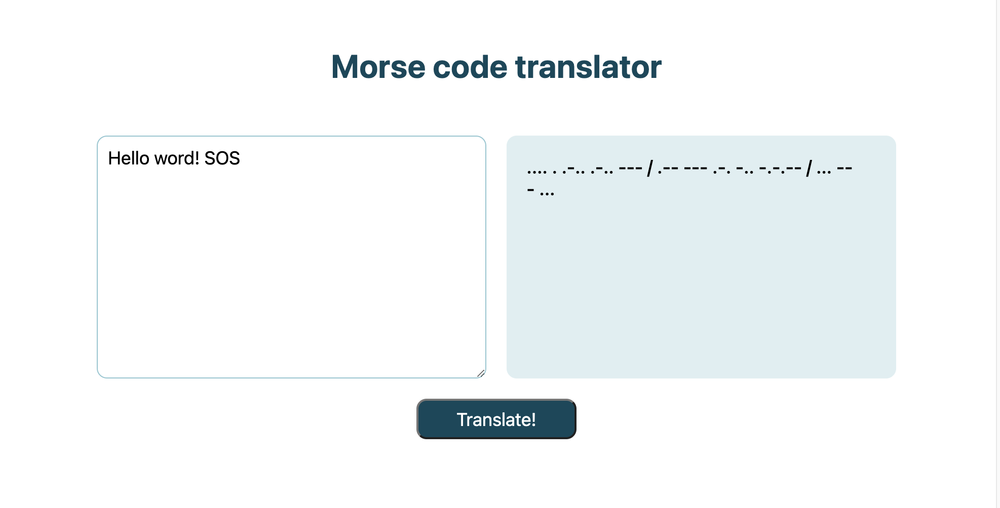

# Morse Code Translator

## Overview

The morse code translator tranlates English text (A-Z, numbers and some
punctuation) into morse code and vice versa. I created it using JavaScript and
SCSS, and I used Jest to create unit tests for my translation functions.

## Demo & Snippets

---

## Requirements / Purpose

The MVP for this project was to create an interface that allows the user to input either English or Morse Code, and have functions in JavaScript that take that user input and translate it. For the project's bonus challenge, I set it up so that on clicking "translate" will auto-detect whether the user has written English or Morse Code, and will use the right translation function.

One of the main purposes of the project was to practice writing tests for the translating functions, which I have done so using Jest. The project also tested my knowledge of DOM manipulation and I used this project to practice creating reusable DOM utils so that I could reduce the amount of repetition in the code.

---

## Build Steps

To run this application correctly on your local machine when using VS Code, you must use the Live Server extension. 
The JS functions will not run if you open the index.html file.

---

## Design Goals / Approach

For this project, I kept the design of the interface quite simple and focused more on refactoring code and testing for edge cases. My goal was to design my code in such a way that I minimise repetition as much as possible, and create reusable functions/DOM utils to reduce the amount of code needed inside of event listeners.

---

## Features

The Morse Code Translator has the following features:

-   An input field where the user can write either English or Morse Code, and have the language auto-detected
-   Encode and decode functions, that allow for English to be translated into Morse Code and vice versa
-   Tests written in Jest that check that both the encode and decode functions are performing as expected

---

## Future Goals

Given more time, I'd love to:

-   Design a nicer user interface
-   Set up a function that reverses the encodeMorse function, rather than having two separate objects for both encoding and decoding
